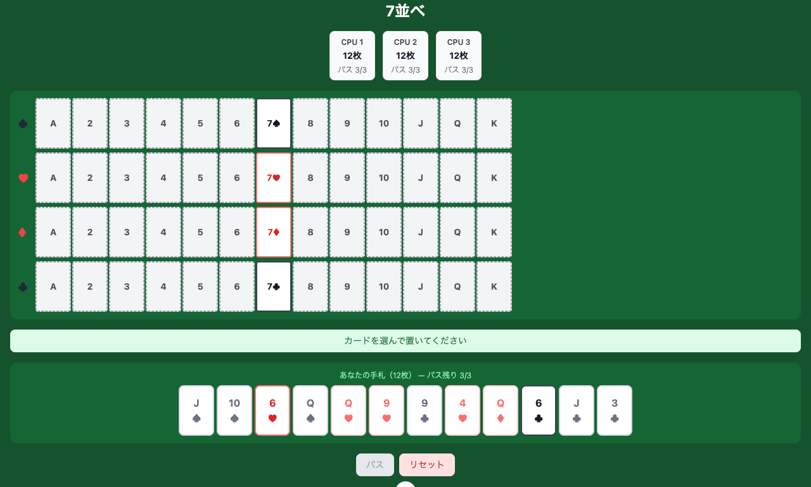

# 7並べ

[](https://github.com/tasuku/sevens/actions/workflows/ci.yml)

ブラウザで遊べる 7並べの実装です。あなた（人間）1人と CPU 3人の計4人で対戦します。



## ゲームルール

- 52枚のトランプを4人に配る
- 各スートの 7 を起点に、6→5→… または 8→9→… と順番にカードを出していく
- 手番でカードを出せない場合はパス（最大 3回）
- 先に手札をすべて出したプレイヤーが勝利

## 機能

- CPU 3体との対戦（自動で思考・プレイ）
- PWA 対応（ホーム画面へのインストール・オフライン動作）
- ゲーム状態の localStorage 永続化
- TypeScript による型安全な実装

## 技術スタック

| カテゴリ       | 採用技術            |
| -------------- | ------------------- |
| フレームワーク | Nuxt 4 / Vue 3      |
| 言語           | TypeScript          |
| スタイリング   | Tailwind CSS        |
| テスト         | Vitest + Playwright |
| パッケージ管理 | pnpm                |

## セットアップ

```bash
pnpm install
```

## コマンド

```bash
pnpm dev       # 開発サーバー起動 (http://localhost:3000)
pnpm build     # プロダクションビルド
pnpm preview   # ビルド結果のプレビュー
pnpm test      # テスト実行
pnpm lint      # 型チェック・Lint
```

## プロジェクト構成

```
app/
├── game/            # ゲームロジック（UI 非依存）
│   ├── constants.ts
│   ├── deck.ts
│   ├── rules.ts
│   ├── cpu.ts
│   └── state.ts
├── components/game/ # ゲーム UI コンポーネント
├── composables/     # Vue Composition API フック
├── types/           # TypeScript 型定義
└── utils/           # ユーティリティ関数
tests/               # ブラウザテスト（Playwright）
```
